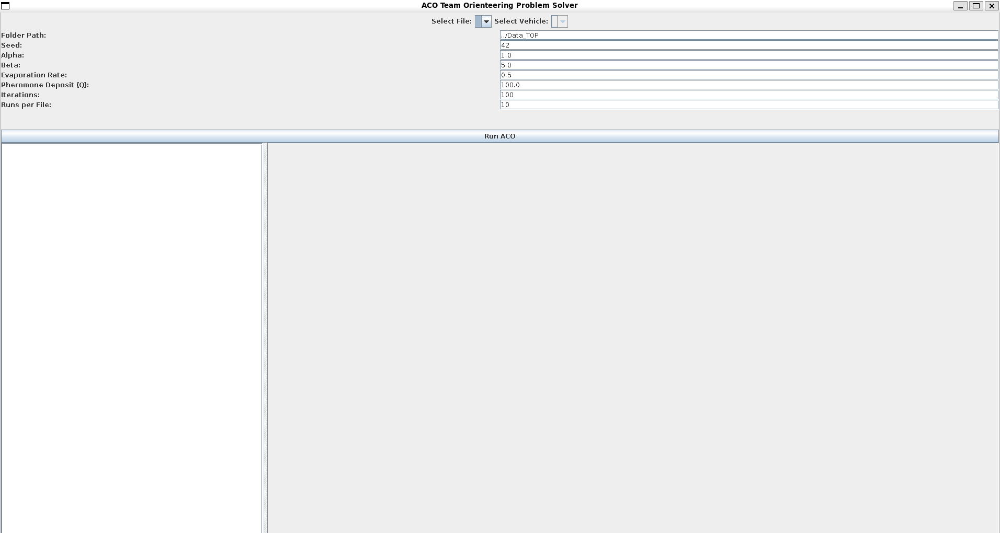
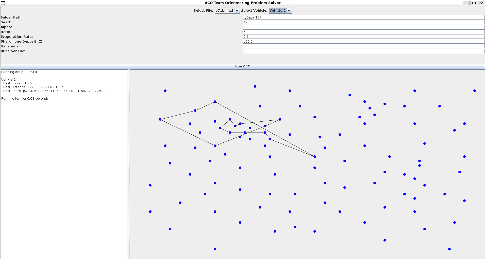

# Ant Colony Optimization (ACO) for the TOP Problem

## Overview
This program solves a variant of the Team Orienteering Problem (TOP) using an Ant Colony Optimization (ACO) algorithm. The goal is to maximize the total score collected by multiple vehicles, each starting and ending at a depot, under a maximum travel distance constraint.

The solution includes:
- ACO core logic (ACO.java, Ant.java, PheromoneMatrix.java)
- Problem modeling (Node.java, ProblemInstance.java)
- Utility functions for distance calculations (DistanceUtils.java)
- A simple GUI for interaction (ACOGUI.java)

## How to Run

This software is distributed as an executable `.jar` file.

### Requirements:
- Java SE 8 or higher installed.
- No external libraries required.
- The program runs **without an IDE**.

### To Execute:
```bash
java -jar topaco.jar
```

The application will start, and you can load a problem instance from the Data_TOP/ folder if needed.

## File Structure

```
topaco.jar
Data_TOP/                 <-- Folder containing problem instance files

Inside the JAR:
src/
 └── topaco/
      ├── aco/
      │    ├── ACO.java
      │    ├── Ant.java
      │    └── PheromoneMatrix.java
      ├── gui/
      │    └── ACOGUI.java
      ├── model/
      │    ├── Node.java
      │    └── ProblemInstance.java
      └── utils/
           └── DistanceUtils.java
```

## Algorithm Overview

The ACO algorithm works by simulating multiple "ants" that explore possible paths through the nodes to find high-scoring routes. Each ant:
1. Constructs a solution by probabilistically selecting nodes based on pheromone levels and heuristic information
2. Updates pheromone trails based on solution quality
3. Repeats the process over multiple iterations to converge on optimal or near-optimal solutions

The algorithm efficiently balances exploitation (following known good paths) and exploration (discovering new paths).

## Program Features

- Load problem instances from standardized TOP format files
- Configure ACO parameters (iterations, number of ants, etc.)
- Visualize best solutions found
- Export results for further analysis

## Building From Source

### Compile the project:
```bash
cd src
javac topaco/**/*.java
```

### Package into JAR:
```bash
jar cfe topaco.jar topaco.gui.ACOGUI topaco/ ../Data_TOP/
```

### Run the JAR:
```bash
java -jar topaco.jar
```

### You should expect to see something like this:


### Example Solution after setting Parameter set-up you'll hit `Run ACO`:


## Authors
Developed by: [Tiyiso]
